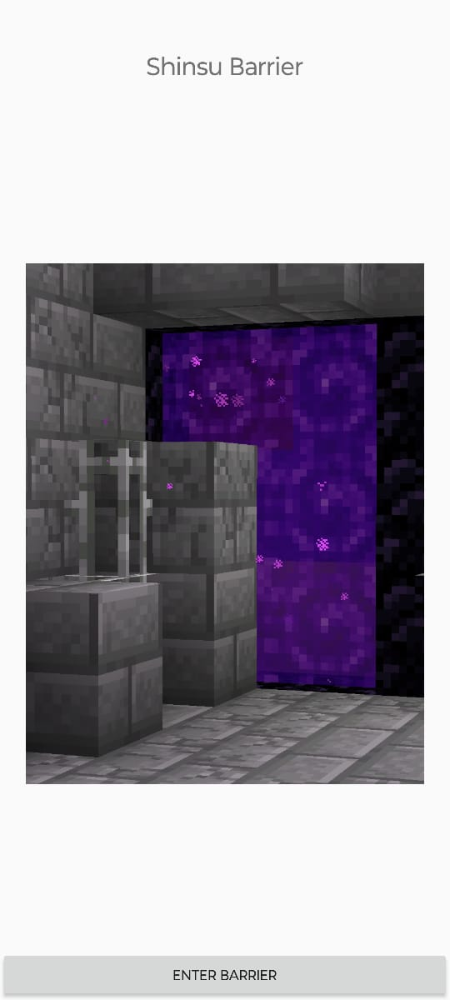

# CitadelCTF
My writeups for challenges from CitadelCTF
# 1. Case Sensitivity
## Description:
You step into a constricted floor where every movement and operation is limited. Commands are few, space is tight, and options are restricted.

A guardian looms over the floor, its body shifting like liquid metal, enforcing these constraints. It watches your every move, daring you to make do with what you have and uncover the passcode to the next floor despite the restrictions.

Connection: `nc chall_citadel.cryptonitemit.in 32770`
## Solution:
On connecting to the given server, we get the following prompt:
```
$ nc chall_citadel.cryptonitemit.in 32770
Ha, I bet you can't find what "FLAG" is in this shitty python interpreter.
What could you possibly even do here?

>>>
```
On inputting simple commands like `help`, we get this response:
```
>>> help

ERROR:
Traceback (most recent call last):
  File "/home/user/pyjail_challenge.py", line 26, in <module>
    exec('from os import *; ' + clean(user_input))
  File "/home/user/pyjail_challenge.py", line 18, in clean
    raise ValueError(f"NUH UH, {word} is not allowed!{although}")
ValueError: NUH UH, help is not allowed!
```
The error tells us that it's sort of a _jail_, with only a few whitelisted keywords being allowed. On trying `print`, we get a clue of sorts:
```
>>> print

ERROR:
Traceback (most recent call last):
  File "/home/user/pyjail_challenge.py", line 26, in <module>
    exec('from os import *; ' + clean(user_input))
  File "/home/user/pyjail_challenge.py", line 18, in clean
    raise ValueError(f"NUH UH, {word} is not allowed!{although}")
ValueError: NUH UH, print is not allowed! (although print is very close)
```
`(although print is very close)` combined with the challenge's name _(Case Sensitivity)_ tells us that the _case_ of the commands will be important in this challenge. 

Through such trial and error, we get to know that `environ` gives a similar hint, `exec` is downright allowed, and that `PRINT` and `ENVIRON` specifically are not defined, meaning that they are _whitelisted_,  showing an error like this:
```
ERROR:
Traceback (most recent call last):
  File "/home/user/pyjail_challenge.py", line 26, in <module>
    exec('from os import *; ' + clean(user_input))
  File "<string>", line 1, in <module>
NameError: name 'PRINT' is not defined
```
Now, combining all these facts, and given that `environ` gives a hint, we deduce that `FLAG` must be an environment variable, and we design one command that takes the upper case `PRINT ENVIRON`, and somehow turns it to `print environ`, while bypassing the _whitelist_ as well:

```
>>> exec("PRINT".lower() + "(ENVIRON)".lower())
environ({'LC_CTYPE': 'C.UTF-8', 'FLAG': 'citadel{d34th_d035_n07_fr33_y0u_fr0m_7h3_gu17ar15t}'})
```
By using `lower.()`, we are able to manipulate the case of `PRINT` and `ENVIRON` and successfully get the flag.

## Flag
`citadel{d34th_d035_n07_fr33_y0u_fr0m_7h3_gu17ar15t}`

# 2. A Memory's a Heavy Burden
## Description:
You now find yourself in the place where many climbers have been laid to rest. A cold wind moves through the *temple* grounds, carrying whispers of the departed. Stone lanterns and marble graves reflect *Buddhist* traditions, their shadows stretching across the frost-covered earth.

The temple rests in the shadow of a very iconic mountain, quiet and imposing. Every detail in the image, the arrangement of the graves, the lanterns, and the lingering scent of incense, holds clues to its true location. You need to uncover the exact coordinates of where you are to move on from here.

Note: round off coordinates to 3 decimal places.

Flag format: `citadel{XX.XXX_XXX.XXX}`

Image included:


## Solution:
Based on observation of the italicized words in the challenge description and the image, we can deduce that the location is a Buddhist temple with a cemetery north of Mt. Fuji (based on the compass arrow in the bottom right).

The location also overlooks a town/settlement so it has to be elevated with respect to them and it borders a forest to the west.

First, we use Satellite view on Google Maps to narrow down our search to the _Narusawa_ and _Fujikawaguchiko_ regions, as they seem to be bordered by forests and have multiple temples in the area. 


Next, we search for temples in the area and view them on Google Street View:


Going through the temples, we eventually find the _Tsūgenji_ temple, which has a cemetery similar to the original photo 


We move our street view along the road that the temple lies on and rotate our view towards the temple to find the exact location of the challenge's photo: 


Now, we just need to get its coordinates like so and round them off for the flag, which is `citadel{35.486_138.699}`


## Flag:
`citadel{35.486_138.699}`

# 3. Shinsu DEXQuest
## Description:
As you climb the path, a guardian emerges, its form shifting between the visage of a long-dead climber and a metallic sentinel.

It moves with a strange grace, holding out a cartridge containing a single file.

You realize the file is compatible with the device you carry and may be the key to continue your ascent toward the Citadel’s heart. 

[APK file included](citadel/dexquest.apk)

## Solution:
Run the `.apk` file on an Android device to find a landing page with a cryptic description.


On swiping to the left, we find a _Shinsu Barrier_, and on trying to press the button to `enter` the _barrier_, the app closes. We can also keep trying to swipe left and get a glimpse of a room with a flag built in Minecraft, with a prompt that says `<FLAG>`, presumably the end of the challenge. 

On swiping to the right, we find a page with an observer from Minecraft and a button that says `OBSERVE THE OBSERVER` which on clicking leads to:


At this point, we decompile the `.apk` file with JADX and after giving some random input to the text box, we search the source code for keywords on screen, like `Correct: 🟢 n Probably ¯\\_(ツ)_/¯` where n is a number.


Going through the source, we find the logic behind the Sealed Observer at `sources/com/shinsu/dexquest/screens/Vault.java`


We see that when `green == 99`, we get the _Shinsu Stabilizer Crystal_ and the next floor is unlocked, and that the variable `green` gets its value from the output of the `correctDigits` function when run with the user's input.

The `correctDigits` function goes through the user's input digit by digit and checks whether it is a specific number or not, which we can take to another programming language and get the number from.


# 4. The Sound of Music
## Description:
🗼OSINT pt2: `citadweller` had a newfound interest in tracking the music they last listened to and posting ratings of new albums on various online platforms.

The flag is hidden in these digital footprints across music platforms and split into three segments. You will need to find all three to uncover the complete code and move on to the next floor.
## Solution:
Using the challenge description, we can deduce that `tracking the music they last listened to` refers to the website [last.fm](https://last.fm) and `posting ratings of new albums` refers to [rateyourmusic](https://rateyourmusic.com).

On these platforms, we look for the user `citadweller` and find two profiles:
 

Scrolling down on the last.fm profile, we get pt. 1 of the flag in the user's _shoutbox_: `citadel{c0mputers_st0pped_exchang1ng_1nf0rmat10n` 

On the RYM profile, we get pt. 2: `_n_started_shar1ng_st0r1es`
 
 On the same profile, we also see a `tinyurl` link that leads to a [Spotify profile](https://open.spotify.com/user/317w4n4m2a4btks6hrqomyo3wpqu) with one [public playlist](https://open.spotify.com/playlist/37eiwS3xaRXOsg4F5RmSsY).
 Here, we find pt. 3 (`_n_then_they_were_n0where_t0_be_f0und}`)

Combining all three parts, we get the flag.

## Flag:
`citadel{c0mputers_st0pped_exchang1ng_1nf0rmat10n_n_started_shar1ng_st0r1es_n_then_they_were_n0where_t0_be_f0und}`

# 5. schlagenheim
## Description:
Your quest continues, but you feel something odd about this room. The only artifact on this floor is a corrupted file held in the hands of a jet-black statue, frozen in the pose of a band _mid_-performance. The passcode to the next floor is hidden within this piece of music, but it can’t be played, as if the wrong extension has scrambled it.

You must take the corrupted file and repair it to reveal the true code that will unlock the door forward.

[`.wav` file included](citadel/mysong.wav)
## Solution:
On attempting to run the .wav file, it doesn't load in standard audio players, throwing the following error:


This suggests the file is not supposed to be a `.wav` file, and reading the description carefully, we see that an italicization of _mid_, suggesting that the file might be a `.midi` file.

We open the file in a hex editor to investigate further and observe that that the _magic bytes_ of the file have been changed to spell `M1D1`, further suggesting that the file is supposed to be a `.midi`. file.


We change them to `MThd`, the proper header for a `.midi` file and open it in Audacity to immediately find that the `midi` sequence spells out the flag for us.


## Flag:
`citadel{8lackM1D1wa5c00l}`
